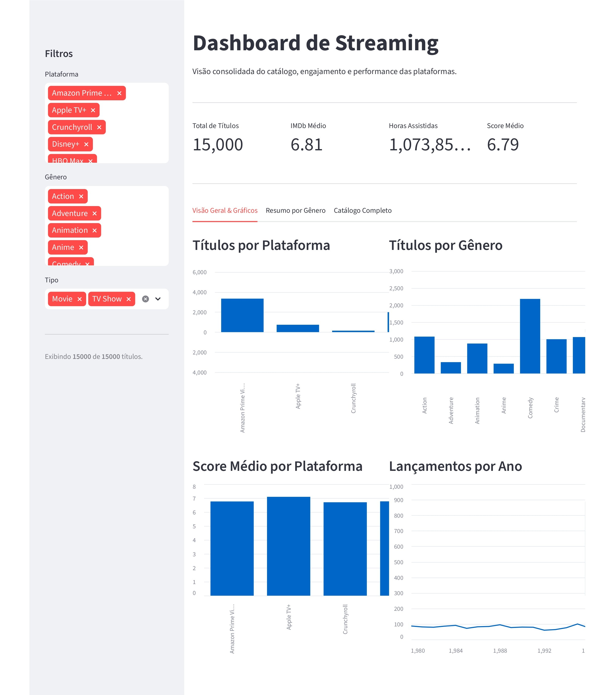

# Projeto de ETL com Dados de Streaming


## Visão Geral

Este projeto foi desenvolvido como parte de um desafio prático com foco na compreensão do processo de **ETL (Extração, Transformação e Carregamento)** utilizando Python. O objetivo foi simular um pipeline de dados real e demonstrar a capacidade de coletar, tratar, transformar e visualizar dados.


## Dataset

Dataset disponível no Kaggle:
https://www.kaggle.com/datasets/meruvakodandasuraj/streaming-content-catalog-netflix-prime-disney/data

O dataset contém mais de 15.000 títulos de plataformas de streaming (Netflix, Prime Video, Disney+, etc.), incluindo avaliações, gêneros, tempo assistido e outras informações.


## Requisitos da atividade


* **Extração:** Carregar dados de uma fonte externa (API ou CSV)
* **Transformação:** Limpar, tratar e enriquecer os dados
* **Carregamento:** Salvar os dados processados para análise

## O que foi implementado

### Extração

* Carreguei dois arquivos CSV utilizando pandas

Arquivos:

* `streaming_catalog.csv`
* `genre_summary.csv`

### Transformação

* Removi duplicatas
* Converti tipos de dados (avaliações e ano)
* Removi valores nulos
* Selecionei colunas relevantes
* Criei novas métricas:

  * **Engagement** (ou engajamento, baseado em horas assistidas)
  * **Score** (ou pontuação, combinação ponderada de IMDb e Rotten Tomatoes)
* Criei a classificação `release_period`
* Realizei o merge dos datasets por gênero

### Carregamento

**PT-BR:**
Salvei o dataset tratado como `processed_data.csv`.


## Visualização no Power BI

Após o processamento dos dados, desenvolvi um dashboard no Power BI com:

* Comparação entre plataformas (engajamento)
* Gêneros mais populares por plataforma
* Análise de score (qualidade do conteúdo)
* Tendências por período de lançamento
* Filtros interativos

---

## Aprendizados

* Compreensão prática do pipeline ETL
* Limpeza e transformação de dados
* Trabalho com datasets reais
* Melhoria na criação de visualizações

---

## Tecnologias

* Python (pandas e streamlit)
* Power BI
* Kaggle (datasets)

### Executando

```
  # instale as bibliotecas:
  pip install -r requirements.txt

  # execute o streamlit:
  streamlit run app.py
```
### Exibição



> Este projeto foi criado com objetivo de estudos e tem como foco o processo de ETL e simula um fluxo de dados real.